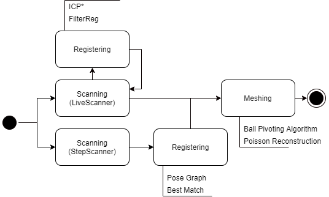
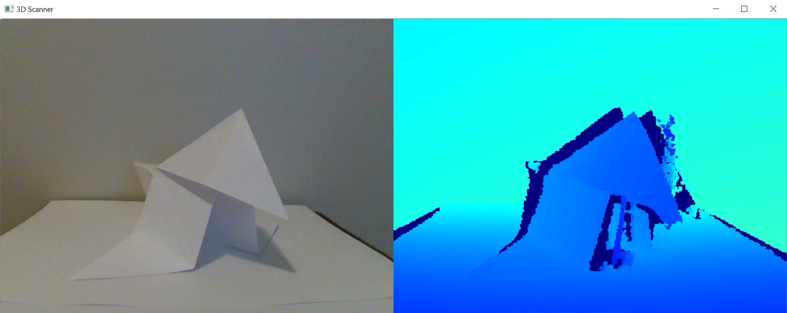

# 3DMeshReconstruction

Using registration algorithms to reconstruct 3D objects with the SR300 camera



*Element implemented in the current project

## Interfaces

The main interface uses OpenCV and as such is quite limited. Here are the implemented key bindings:

- `s` : Take a capture
- `r` : Start recording (takes multiple capture until R is pressed again)
- `q` : Stop capture
    - In live mode, starts mesh generation
    - In step mode, starts registration
- `c` : Delete the last capture



## Command line usage

**Make sure that your camera is connected otherwise the interface will be unresponsive**

```
usage: run.py [-h] [--mode [MODE]] [--output-file [OUTPUT_FILE]]
              [--mesh-reconstruction-method [MESH_RECONSTRUCTION_METHOD]]
              [--max-triangle-count [MAX_TRIANGLE_COUNT]]
              [--ensure-consistency] [--log-level [LOG_LEVEL]]

Scan a 3D object and save the mesh file

optional arguments:
  -h, --help            show this help message and exit
  --mode [MODE]         Mode, should be one of live or step
  --output-file [OUTPUT_FILE]
                        Name of the output file
  --mesh-reconstruction-method [MESH_RECONSTRUCTION_METHOD]
                        Method that will be used to create a mesh from the
                        point cloud. One of [BPA|Poisson]
  --max-triangle-count [MAX_TRIANGLE_COUNT]
                        Maximum triangle count, default is -1 (None)
  --ensure-consistency  Whether to clean the resulting mesh or not
  --log-level [LOG_LEVEL]
                        Python loglevel to use should be one of (DEBUG, INFO,
                        WARNING, ERROR)
```

## Tests

Most features have some level of coverage. You can run the unit tests with `python tests.py`. Due to the nature of 3D registration you can expect up to 20 minutes for the whole test suite to complete.
